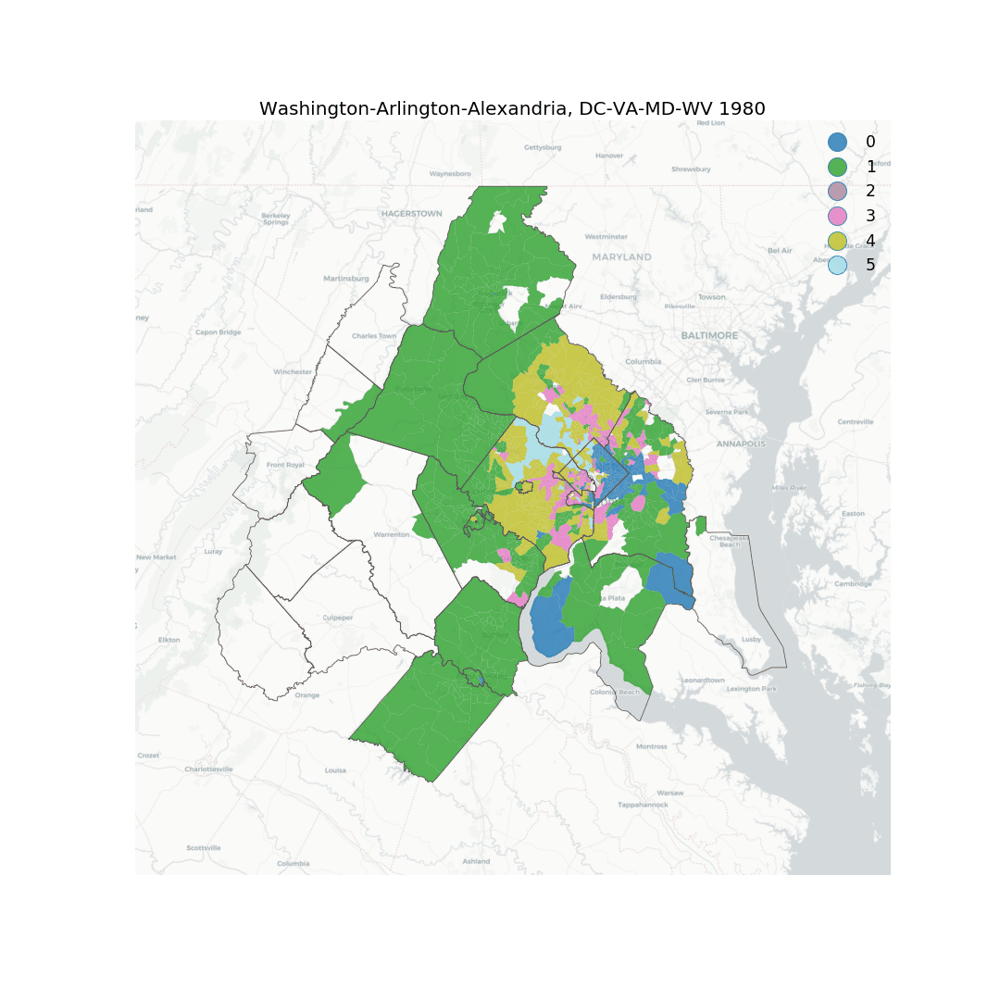

# Geospatial Neighborhood Analysis in Python
[](https://travis-ci.com/spatialucr/geosnap)  [](https://coveralls.io/github/spatialucr/geosnap?branch=master&service=github)


`geosnap` is an open-source, Python3 package for exploring, modeling, and visualizing neighborhood dynamics. Although neighborhoods are critically important for human development and public policy, they present a variety of novel challenges for urban researchers:

-  there is no formally accepted scientific definition of ["neighborhood"](https://www.cnu.org/publicsquare/2019/01/29/once-and-future-neighborhood)
- neighborhoods evolve through both space and time
- many different physical and social data can characterize a neighborhood
- primitive spatial units change boundaries over time

geosnap aims to help fill these gaps. It provides a suite of tools for creating socio-spatial datasets, harmonizing those datasets into consistent set of time-static boundaries, and modeling neighborhood change using classic and spatial statistical methods. 





Since there is no accepted definition of "neighborhood," most quantitative studies involving [neighborhood effects](https://www.annualreviews.org/doi/10.1146/annurev.soc.28.110601.141114) or [neighborhood dynamics](https://www.sciencedirect.com/science/article/pii/S0094119000921818) use census data and their administrative boundaries to define spatial areas that reasonably approximate neighborhoods. In the U.S., this typically means using census tracts, since they have a relatively small spatial footprint and a wide variety of variables are tabulated at that scale. For this reason, geosnap's first release is targeted at researchers working with US Census tract data. This allows the software to make available a wide variety of data and commonly-used variables with minimal interaction from the end-user. Later releases will expand functionality to other geographies and data sources.  

## Modules:

#### `data`  
Ingest, create, and manipulate space-time datasets
#### `analyze` 
Analyze and model neighborhood dynamics
#### `harmonize`  
Harmonize neighborhood boundaries into consistent, stable units using spatial statistical methods
#### `visualize`    
Visualize neighborhood dynamics


## Installation
The recommended method for installing geosnap is with [anaconda](https://www.anaconda.com/download/). To get started with the development version, clone this repository or download it manually then `cd` into the directory and run the following commands:

```bash
$ conda env create -f environment.yml
$ source activate geosnap 
$ python setup.py develop
```

This will download the appropriate dependencies and install geosnap in its own conda environment.

## Getting Started

The quickest way to get started analyzing the space-time dynamics of neighborhoods is by importing a longitudinal dataset that has already been harmonized into consistent boundaries. We recommend the (free) Longitudinal Tract Database to get started. 

You can import LTDB using the instructions in this [example notebook](https://github.com/spatialucr/geosnap/blob/master/examples/01_getting_started.ipynb). **Note:** *you only need to import the database once and it will be stored inside `geosnap` for repeated queries*

Once the LTDB data is installed, check out the other notebooks in the [example](https://github.com/spatialucr/geosnap/tree/master/geosnap/examples) directory, then start `ipython` or a Jupyter Notebook and hack away


## Development

geosnap development is hosted on [github](https://github.com/spatialucr/geosnap)


## Bug reports

To search for or report bugs, please see geosnap's [issues](http://github.com/spatialucr/geosnap/issues)


## License information

See the file "LICENSE.txt" for information on the history of this
software, terms & conditions for usage, and a DISCLAIMER OF ALL
WARRANTIES.

## Funding
 This project is supported by NSF Award #1733705, [Neighborhoods in Space-Time Contexts](https://www.nsf.gov/awardsearch/showAward?AWD_ID=1733705&HistoricalAwards=false)
