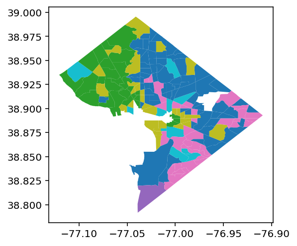

<p align="center">

</p>

<h2 align="center" style="margin-top:-10px">The Geospatial Neighborhood Analysis Package</h2> 

[](https://github.com/spatialucr/geosnap/actions?query=workflow%3A.github%2Fworkflows%2Funittests.yml)
[](https://codecov.io/gh/spatialucr/geosnap)


[](https://doi.org/10.5281/zenodo.3526163)

`geosnap` makes it easier to explore, model, analyze, and visualize the social and spatial dynamics
of neighborhoods.
Neighborhoods are important for a wide variety of reasons, but they’re hard to study
because of some long-standing challenges, including that

- there is no formal definition of a
  [“neighborhood”](https://www.cnu.org/publicsquare/2019/01/29/once-and-future-neighborhood) so
  identifying and modeling them is fraught with uncertainty
- many different physical and social data can characterize a neighborhood (e.g. its
  proximity to the urban core, its share of residents with a high school education, or the
  median price of its apartments) so there are countless ways to model neighborhoods by
  choosing different subsets of attributes
- conceptually, neighborhoods evolve through both space and time, meaning their
  socially-construed boundaries can shift over time, as can their demographic makeup.
- geographic tabulation units change boundaries over time, meaning the raw data are
  aggregated to different areal units at different points in time.

To address these challenges, `geosnap` provides a suite of tools for creating socio-spatial
datasets, harmonizing those datasets into consistent set of time-static boundaries,
modeling bespoke neighborhoods and prototypical neighborhood types, and modeling
neighborhood change using classic and spatial statistical methods.
It also provides a set of static and interactive visualization tools to help you display
and understand the critical information at each step of the process.

**Batteries Included:**
`geosnap` comes packed with 30 years of census data, thanks to [quilt](https://quiltdata.com/), so you
can get started modeling neighborhoods in the U.S. immediately.
But you’re not just limited to the data provided with the package. `geosnap`
works with any data you provide, any place in the world.

<p align="center">

</p>

## Installation

The recommended method for installing geosnap is with
[anaconda](https://www.anaconda.com/download/). 

```bash
conda install -c conda-forge geosnap
```

`geosnap` is alaso available on PyPI and can be install with pip via

```bash
pip install geosnap
```

## User Guide 
See the [User Guide](https://spatialucr.github.io/geosnap-guide/) for a
gentle introduction to using `geosnap` for neighborhood research 
## API Documentation

See the [API docs](https://spatialucr.github.io/geosnap/api.html) for a thorough explanation of `geosnap`'s core functionality


## Quickstart

the `Community` class is geosnap’s central data construct that holds space-time neighborhood data.  
You can create a `Community` from geosnap’s built-in data by passing a set of fips codes to a
constructor method

```python
from geosnap import Community
dc = Community.from_census(state_fips='11')
```

Using the `.from_census` constructor, you’ll get 30 years of census tract data in their original
boundaries with over a hundred commonly used demographic and socioeconomic variables.
Data are stored as a long-form geodataframe under the `gdf` attribute

```python
dc.gdf.head()
```

<div>
<table border="1" class="dataframe">
  <thead>
    <tr style="text-align: right;">
      <th></th>
      <th>geoid</th>
      <th>geometry</th>
      <th>median_contract_rent</th>
      <th>median_home_value</th>
      <th>median_household_income</th>
      <th>median_income_asianhh</th>
      <th>median_income_blackhh</th>
      <th>median_income_hispanichh</th>
      <th>median_income_whitehh</th>
      <th>n_age_5_older</th>
      <th>...</th>
      <th>p_unemployment_rate</th>
      <th>p_vacant_housing_units</th>
      <th>p_veterans</th>
      <th>p_vietnamese_persons</th>
      <th>p_white_over_60</th>
      <th>p_white_over_65</th>
      <th>p_white_under_15</th>
      <th>p_widowed_divorced</th>
      <th>per_capita_income</th>
      <th>year</th>
    </tr>
  </thead>
  <tbody>
    <tr>
      <th>53214</th>
      <td>11001001600</td>
      <td>POLYGON ((-77.02680206298828 38.98410034179688...</td>
      <td>477.0</td>
      <td>285100.0</td>
      <td>75252.0</td>
      <td>NaN</td>
      <td>NaN</td>
      <td>NaN</td>
      <td>NaN</td>
      <td>4.742191e+70</td>
      <td>...</td>
      <td>0.0</td>
      <td>2.58</td>
      <td>1.028308e+08</td>
      <td>0.00</td>
      <td>3.159920e+25</td>
      <td>4.999423e+17</td>
      <td>1.378187e+24</td>
      <td>0.0</td>
      <td>32166.0</td>
      <td>1990</td>
    </tr>
    <tr>
      <th>53215</th>
      <td>11001001500</td>
      <td>POLYGON ((-77.05280303955078 38.98649978637695...</td>
      <td>1001.0</td>
      <td>366000.0</td>
      <td>79681.0</td>
      <td>NaN</td>
      <td>NaN</td>
      <td>NaN</td>
      <td>NaN</td>
      <td>1.025723e+72</td>
      <td>...</td>
      <td>0.0</td>
      <td>3.38</td>
      <td>7.095389e+07</td>
      <td>0.23</td>
      <td>6.529311e+30</td>
      <td>1.483617e+23</td>
      <td>6.816417e+33</td>
      <td>0.0</td>
      <td>36452.0</td>
      <td>1990</td>
    </tr>
    <tr>
      <th>53216</th>
      <td>11001001701</td>
      <td>POLYGON ((-77.02660369873047 38.97769927978516...</td>
      <td>429.0</td>
      <td>135600.0</td>
      <td>34420.0</td>
      <td>NaN</td>
      <td>NaN</td>
      <td>NaN</td>
      <td>NaN</td>
      <td>6.918716e+64</td>
      <td>...</td>
      <td>0.0</td>
      <td>3.89</td>
      <td>8.990532e+05</td>
      <td>0.10</td>
      <td>1.184601e+14</td>
      <td>1.285720e+10</td>
      <td>8.476736e+15</td>
      <td>0.0</td>
      <td>17782.0</td>
      <td>1990</td>
    </tr>
    <tr>
      <th>53217</th>
      <td>11001001801</td>
      <td>POLYGON ((-77.02660369873047 38.97769927978516...</td>
      <td>1001.0</td>
      <td>0.0</td>
      <td>77197.0</td>
      <td>NaN</td>
      <td>NaN</td>
      <td>NaN</td>
      <td>NaN</td>
      <td>3.084115e+31</td>
      <td>...</td>
      <td>0.0</td>
      <td>10.00</td>
      <td>5.229000e+01</td>
      <td>0.00</td>
      <td>1.450982e+11</td>
      <td>1.437909e+08</td>
      <td>1.321830e+14</td>
      <td>0.0</td>
      <td>14679.0</td>
      <td>1990</td>
    </tr>
    <tr>
      <th>53218</th>
      <td>11001001702</td>
      <td>POLYGON ((-77.00859832763672 38.97000122070312...</td>
      <td>514.0</td>
      <td>129300.0</td>
      <td>42661.0</td>
      <td>NaN</td>
      <td>NaN</td>
      <td>NaN</td>
      <td>NaN</td>
      <td>4.210494e+62</td>
      <td>...</td>
      <td>0.0</td>
      <td>3.96</td>
      <td>7.219278e+04</td>
      <td>0.04</td>
      <td>4.438992e+13</td>
      <td>2.147213e+10</td>
      <td>2.352939e+17</td>
      <td>0.0</td>
      <td>20468.0</td>
      <td>1990</td>
    </tr>
  </tbody>
</table>
<p>5 rows × 195 columns</p>
</div>

you can create a [geodemographic typology](https://en.wikipedia.org/wiki/Geodemography) using
classic clustering methods on the `Community`

```python
dc = dc.cluster(method='kmeans', n_clusters=6, columns=['p_unemployment_rate', 'per_capita_income'] )
dc.gdf[dc.gdf.year==2000].plot(column='kmeans')
```

<p align="center">

</p>

you can create a
[regionalization](https://www.sciencedirect.com/science/article/pii/0038012181900409) using
spatially-constrained clustering methods on the `Community`

```python
dc = dc.cluster_spatial(method='spenc', n_clusters=6, columns=['p_unemployment_rate', 'per_capita_income'] )
dc.gdf[dc.gdf.year==2000].plot('spenc')
```

<p align="center">

</p>

You can also [harmonize](https://github.com/spatialucr/tobler) `Community` boundaries so that they’re
consistent over time. For example 

```python
 dc = dc.harmonize(2010, extensive_variables=["population"])
```
will create a new `Community` with population in 1990 and 2000 modeled as 2010 tract boundaries (2010 will remain unchanged). Thanks to [`tobler`](http://github.com/pysal/tobler), geosnap provides several methods for harmonization, from simple areal interpolation to model-based approaches using auxiliary data. See the [harmonization example](https://spatialucr.github.io/geosnap-guide/notebooks/03_harmonizing_community_boundaries.html) for more code samples

You can explore datasets using a prototype interactive dashboard using

```python
from geosnap.visualize import explore
explore()
```


By default, the dashboard will launch with built-in census data, but if you've stored other databases, then you can exlore those as well. 

Many more visualization features coming soon

## Development

geosnap development is hosted on [github](https://github.com/spatialucr/geosnap)

To get started with the development version,
clone this repository or download it manually then `cd` into the directory and run the
following commands:

```bash
conda env create -f environment.yml
conda activate geosnap 
python setup.py develop
```
This will download the appropriate dependencies and install geosnap in its own conda environment.

## Bug reports

To search for or report bugs, please see geosnap’s
[issues](http://github.com/spatialucr/geosnap/issues)

## License information

See the file “LICENSE.txt” for information on the history of this software, terms &
conditions for usage, and a DISCLAIMER OF ALL WARRANTIES.

## Citation

For a generic citation of geosnap, we recommend the following: 

```latex
@misc{Knaap2019,
author = {Knaap, Elijah and Kang, Wei and Rey, Sergio and Wolf, Levi John and Cortes, Renan Xavier and Han, Su},
doi = {10.5281/ZENODO.3526163},
title = {{geosnap: The Geospatial Neighborhood Analysis Package}},
url = {https://zenodo.org/record/3526163},
year = {2019}
}
```
If you need to cite a specific release of the package, please find the appropriate version on [Zenodo](https://zenodo.org/record/3526163)

## Funding

 This project is supported by NSF Award #1733705,
[Neighborhoods in Space-Time Contexts](https://www.nsf.gov/awardsearch/showAward?AWD_ID=1733705&HistoricalAwards=false)
